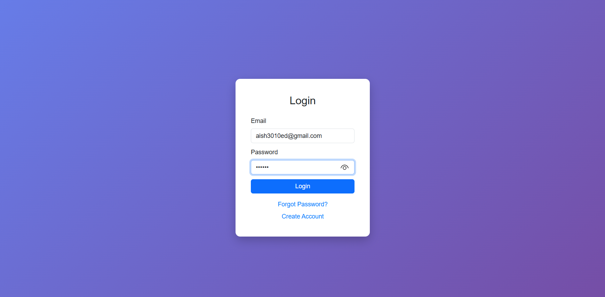
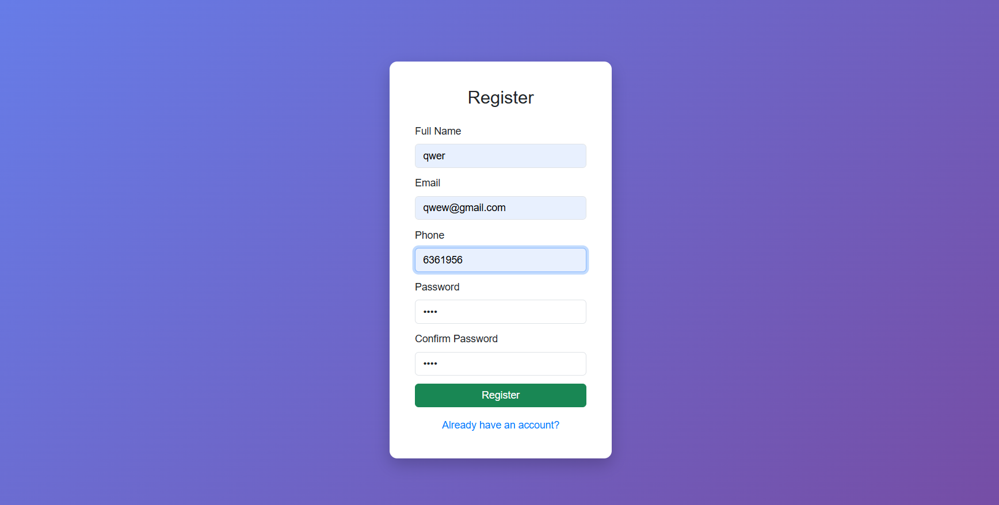
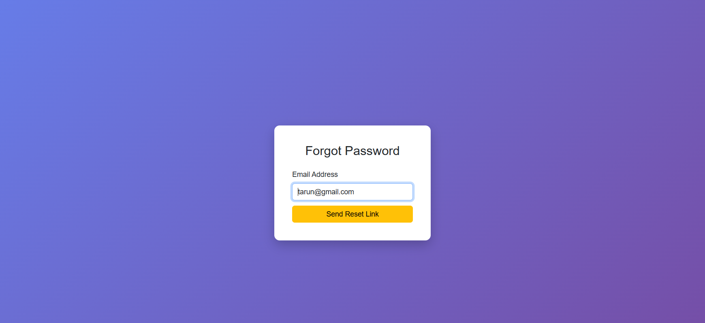
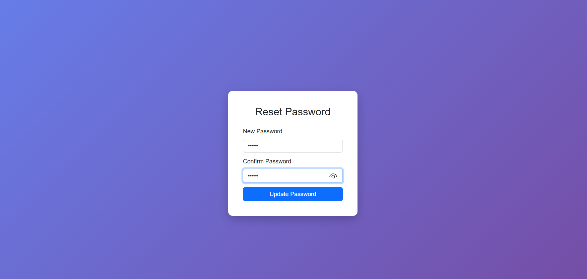
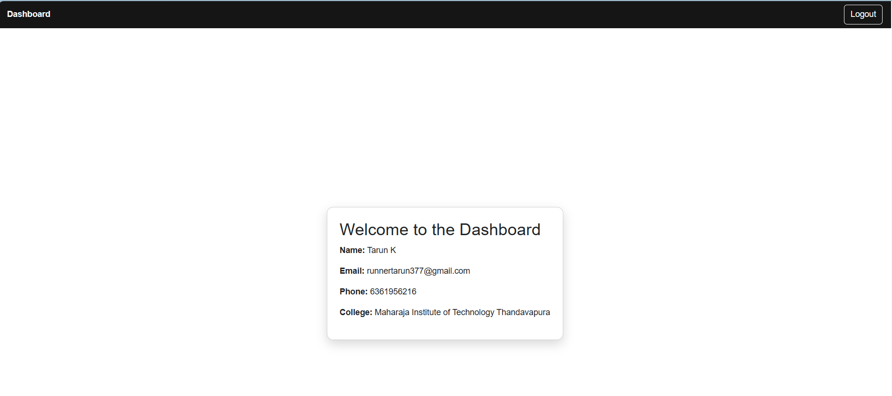

## Objective(HTML)
Create a simple HTML-based authentication system with 5 pages and submit the code via GitHub repository.
## Requirements
Create the following 5 HTML pages with basic redirections:
### Page 1: Login Page (login.html)
1. Username input field
2. Password input field
3. Login button (redirects to Dashboard)
4. "Forgot Password?" link (redirects to Forgot Password page)
5. "Create a New Account" link (redirects to Registration page)
### Page 2: Registration Page (register.html)
1. Name input field
2. Email ID input field
3. Phone Number input field
4. Password input field
5. Confirm Password input field
6. Register button (redirects to Login page)
7. "I already have an account" link (redirects to Login page)
### Page 3: Forgot Password Page (forgot-password.html)
1. Email input field
2. "Send Password Reset Link" button (redirects to Login page)
### Page 4: Reset Password Page (reset-password.html)
1. New Password input field
2. Confirm Password input field
3. "Update Password" button (redirects to Login page)
### Page 5: Dashboard Page (dashboard.html)
1. Display "Welcome to My Dashboard" heading
2. Logout button (redirects to Login page)

## Objective(CSS)
Transform your plain HTML pages into a professional, responsive, and visually appealing application using Bootstrap 5 and custom CSS.
## Task 1: Integrate Bootstrap 5
 Add Bootstrap 5 CDN links to all your HTML pages
 Add Bootstrap Icons CDN for icons (optional but recommended)
 Add Bootstrap JavaScript bundle for interactive components
## Task 2: Style All 5 Pages Using Bootstrap
Apply Bootstrap styling to make your pages look professional:
### Page 1: Login Page
1. Use Bootstrap card component for the login form
2. Use Bootstrap form controls (form-control, form-label classes)
3. Style the Login button using Bootstrap button classes
4. Make links visually appealing
5. Center the login card on the page

### Page 2: Registration Page
1. Use Bootstrap card component for the registration form
2. Style all input fields with Bootstrap form classes
3. Add Bootstrap validation states (optional)
4. Ensure proper spacing using Bootstrap utilities

### Page 3: Forgot Password Page
1. Use Bootstrap card component
2. Style the email input field and button
3. Add proper layout and spacing

### Page 4: Reset Password Page
1. Use Bootstrap card component
2. Add password visibility toggle icons
3. Style the Update Password button

### Page 5: Dashboard Page
1. Add a Bootstrap navbar at the top
2. Use Bootstrap container for the welcome message
3. Style the Logout button
4. Add a professional dashboard layout

## Task 3: Add Custom CSS
Create a separate styles.css file and add:
### Required Custom Styling:
1. Custom color scheme - Choose a professional color palette
2. Custom fonts - Use Google Fonts
3. Hover effects on buttons and links
4. Box shadows for cards
5. Background gradient or pattern
6. Custom spacing where needed
7. Smooth transitions for interactive elements
## Task 4: Make It Responsive
Ensure your application works on:
 - Desktop (1920px and above)
 - Laptop (1366px - 1920px)
 - Tablet (768px - 1024px)
 - Mobile (320px - 767px)
